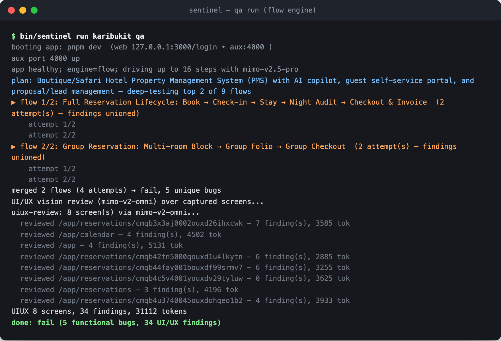
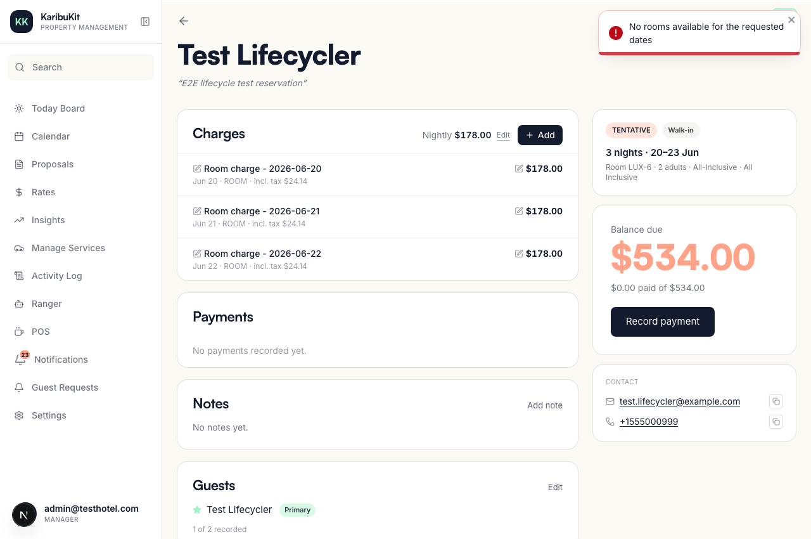
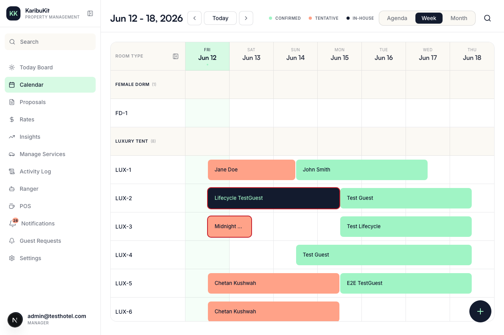
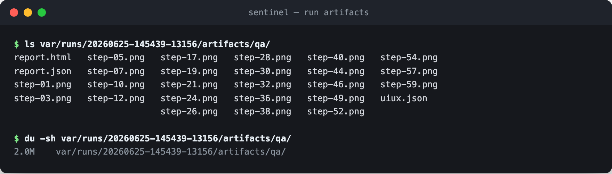

# Most "AI QA" is just a clicker. We built one that reads your code first.

*Sentinel reads the codebase, works out the real business flows, and tests them end to end across the frontend and the backend. It's open source under MIT.*

## The gap between clicking and understanding

Put a typical AI agent on your app and it opens a page, clicks a few buttons, notices a misaligned element or a console error, and calls the run done. That's useful the way a smoke test is useful. The agent has no model of what your product actually does.

A QA engineer worth hiring doesn't click around. They learn the product first, then reason about it: this is a hotel system, so I need to test a single booking, a group booking, a cancellation that frees the room back up, check-in, check-out, and the night audit, and I need to confirm each one actually persisted on the server instead of trusting that the UI looked happy.

## What happened when we gave it a real app and no instructions

We pointed Sentinel at a working full-stack hotel PMS (a property management system): a Next.js frontend, a separate API service, a Postgres database. We gave it no test plan and no list of flows, just the repo and admin credentials for a throwaway test tenant with disposable data.

It read the code, concluded the product was a boutique and safari hotel PMS, and derived nine critical business flows on its own: the full reservation lifecycle, group bookings, the lead-to-proposal pipeline, rate management, guest self-service, mid-stay room changes, the night audit, payment through invoice to refund, and the AI copilot. Cancellations are in there too, as edge cases and backend checks inside those flows rather than a flow of their own. That's close to the list a human QA lead would write on day one, and nobody handed it to the agent.


*The run itself: plan derived from the repo, top two flows deep-tested twice each, then the vision pass over every screen it visited.*

Then it ran the top two of those flows, twice each, and the trace read like watching a person work:

- It called `GET /api/availability`, got a `400`, worked out the params it was missing, and retried with `adults=2&children=0` to get a `200`.
- It created a real reservation with `POST /api/reservations` (`201`), then fetched it back to confirm it had persisted with the right room and rate.
- It walked the status lifecycle, found the check-in endpoint by trial (`/checkin` gave `404`, `/check-in` gave `400`, then a valid call returned `200`), and checked the folio.


*The folio it was verifying: three room-charge nights at $178, balance due $534. The red toast in the corner is a bug being caught live: "No rooms available" on a reservation that already held its room.*

The bugs it surfaced are ones a clicker structurally cannot find:

- Confirming a reservation came back `NO_AVAILABILITY`, even though that same reservation already held the room. A backend state-machine bug the UI turned into a misleading "no rooms available" toast on one attempt, and into no feedback at all on another.
- The calendar showed a room as available after a booking already existed for it. The API and the UI disagreed, and only checking both layers caught it.
- Check-in returned `200`, but the guest's `registrationStatus` stayed `NONE` on the server: a state transition that only half-completed.


*The calendar mid-run, filled with reservations the agent created itself, tentative and confirmed side by side.*

## How it works

The QA agent's deepest engine, `flow`, is a pipeline:

1. Read the repo. A deterministic recon pass (grep and find, no model calls) extracts the structure: frontend routes, API route modules, services, database entities. The model reasons over that digest instead of crawling a monorepo blind, which is slow and misses things.
2. Derive the flows. Mimo, the model we run for decisions through the `pi` agent harness, turns the digest into a prioritized list of end-to-end business flows, each with UI steps, backend assertions, and edge cases. The plan is cached per commit, so it only re-derives when the code changes.
3. Run each flow as an agent loop: the model decides the next action, Playwright drives the browser, and a first-class `api_request` tool checks server state at each step by running `fetch` inside the page, replaying the `Authorization` header the frontend itself sent. The model only ever gets browser and API tools, never your shell or filesystem, and a hard budget bounds each attempt: past 90 tool calls the action tools refuse to act, and the only move left is `finish`.
4. Run it more than once. Autonomous agents are non-deterministic, and we measured it: on one flow, one attempt found zero bugs and another found five. So each flow runs twice by default (`FLOW_ATTEMPTS`, a knob) and the findings are unioned: a bug found by any attempt makes the report, and each flow keeps its worst verdict across attempts.
5. Grade the design. Every distinct screen the agent visits (deduped by URL, up to eight per run by default) also gets a vision pass from a multimodal model, scoring visual hierarchy, spacing, text likely to fail WCAG contrast, typography, and broken states. That's the layer a DOM-only check can't see.

None of it knows anything about hotels. The recon pass digests any repo on the common JS stacks (Next.js routes, Express and Fastify route modules, Prisma, Drizzle, or plain SQL schemas) and everything downstream reasons over the digest, so the hotel PMS was just the demo we had handy; other stacks are a recon patch away.

All of it runs on a schedule: a launchd tick every fifteen minutes checks each repo and runs whatever is due, review on every new commit and QA on whatever cadence you set (every 12 or 24 hours, in ours). The QA agent has three siblings: a code-review agent that reads each new diff, a docs-sync agent that updates your Markdown to match the code inside an isolated worktree (one non-doc file in the changeset and every change is discarded; it never auto-merges), and a brain-sync agent that distills what changed in each repo into a shared knowledge repo, through pull requests it never merges itself.

## How we got here

We started on Mimo, Xiaomi's model family, for the least strategic reason possible: the `pi` agent harness on the machine was already pointed at it. The open question was whether a cheap model could drive a browser well enough to matter, and for version one the answer was no.

Version one was a deterministic Node loop. The script owned control flow and called Mimo as a toolless one-shot brain, once per step: here is the DOM, name the single next action, and the loop ran it through Playwright. It worked on something simple. Against a small product-search app (upload a photo, get visually similar items) it found real bugs for pennies: a three-cent run caught prices truncated mid-value, like "₹4,19", and product cards cut off, and the cheapest run came in at $0.0044. But the loop was the ceiling. The model saw one step at a time with no memory of why it took the last one, so it never accumulated enough context to test a flow with more than a couple of moves. It couldn't get past clicking around a single page.

So we gave the loop to the model. Version two, which we called pi-native, registers Playwright-backed browser tools as a pi extension and lets Mimo drive them inside pi's own agent loop, with full session memory. It went deeper on a single goal. But it still needed a goal, and writing goals by hand is the exact chore we were trying to delete.

Version three is the flow engine described above: read the repo, derive the flows, run each one against the browser and the backend.

## Why Mimo, and what the first runs broke

The model choice got more interesting when we added the design review. We sent screenshots to Mimo for a UI/UX pass and got nonsense back, because the model we were running, `mimo-v2.5-pro`, is text-only. The fix was to read what the Xiaomi API actually serves: alongside the text models it has `mimo-v2-omni`, which is multimodal. Vision calls omni directly over the plain OpenAI-compatible API, one screenshot per call; a rubric-scored one-shot doesn't need an agent harness. And `mimo-v2-omni` is a reasoning model: it kept cutting off before it emitted its JSON verdict until we raised its budget to 6,000 max tokens. A small thing that ate an afternoon.

We do run other models, just not in the hot loop. `claude` makes the surgical Markdown edits for the docs-sync and brain-sync agents inside guarded worktrees, where precision matters more than price and it runs rarely. `codex`, on gpt-5.5, sits in as an optional read-only review engine for when you want a slower, deeper second opinion. What kept Mimo as the default for the always-on work is volume: the premise is a fleet re-reviewing every new commit and re-running QA on a cadence across every repo you give it, and at that volume cost is a design constraint. A Mimo decision is a fraction of a cent, a shallow QA run is a few cents, and the deepest multi-attempt run on the hotel PMS was 364 steps for $1.95.

The first full run against a real full-stack app is where the integration bugs lived, and none of them were the model's fault. Our boot wrapper detached the dev server's session and `next dev` quietly died, so we went back to a plain background boot with a teardown that reaps the whole process tree. Playwright filled the login form before React had hydrated, the empty submit came back a `400`, and a hydration-safe retype that verifies the field actually holds its value fixed it. CORS blocked every call because the frontend spoke to `localhost` while the agent used `127.0.0.1`; an hour lost to a one-line config. The backend assertions returned `401` until we stopped reconstructing the auth token and simply reused the `Authorization` header the frontend was already sending. Unglamorous, all of it. That was most of the actual work.

## The hard one: QA an app you can't even log into

Plenty of apps don't have a login form. They have a Connect Wallet button, and everything past it is gated behind MetaMask or Rabby. A headless agent can't click a browser-extension popup, so for a while those apps were out of reach.

The way in was cleaner than we expected, and it never touched the app's code. A web3 app talks to its wallet through a standard interface: `window.ethereum`, or for newer apps an EIP-6963 announcement the wallet broadcasts to the page. So before the page loads, Sentinel injects its own implementation of that interface, backed by a throwaway private key it keeps in Node. As far as the app can tell it's an ordinary MetaMask, but it's a wallet the agent can drive: the app connects, reads the chain, and signs exactly as it would for a real person, and the key never crosses into the page.

The catch is that these are real apps on a real chain with real money. Point a funded wallet at a live exchange and "QA" can quietly become "opened a leveraged position." So the wallet is a freshly generated, unfunded burner, and we made spending impossible even under misconfiguration: no method that submits a transaction is ever forwarded to the network. We had an adversarial pass go hunting for holes in that promise, and it paid for itself. The first cut checked the wallet's balance and bailed if it held funds, but the check passed silently whenever the balance lookup failed, which is precisely the moment you'd want it to stop. We fixed it to fail closed, then stopped trusting the balance at all: broadcasting is blocked by method name, and anything not on an explicit read-only allow-list is refused outright, so a send variant we never anticipated can't slip through either. Reads go through and sends never do; a key that has ever been used aborts the run.

Then we pointed it at a perpetuals exchange on Arbitrum. Its frontend, to be precise: the app booted locally from a feature branch in a throwaway git worktree, the real backend never ran, and the on-chain reads went to the live chain. The app gates access by wallet whitelist, so Sentinel stubs the gate endpoints at the network layer, and the whitelist stub is the fun one: it encrypts the burner's address with the app's own key, and the app decrypts it and finds its wallet already whitelisted.

The boring problems arrived on schedule. The landing page fetched a backend during server rendering, so with no backend it returned a 500 and the health check never went green; we started the agent on the trading route instead. The public RPC handed back a malformed CORS header (`'*,*'`, a doubled wildcard browsers reject), the app's own on-chain reads all failed, and a seven-step run racked up 71,597 console errors and 35,797 failed requests, cost $1.16, and found zero functional bugs; we routed the app's RPC calls through Node, where CORS doesn't apply and we could retry the flaky ones. A wallet SDK with a placeholder project id threw an error that tripped the framework's full-screen dev overlay, and the overlay silently swallowed every click, so the agent declared the whole page broken; we tore the overlay down and capped the error stream so a noisy app can't bury a run again.

What came out was a real report. On an unfunded burner the agent connected, opened the isolated-margin trade screen, and worked the form like a tester: the Open Position button hung outright on click (an eight-second timeout, no confirmation modal ever appearing), no order preview after entering collateral, no slippage control anywhere in the UI, no balance check (it typed 999,999 and the form shrugged), a wallet connection that silently dropped when you switched margin modes, a leverage slider showing its internal id (`slider-ex-2`) as the label, and a negative amount the validation only half-caught. Nine functional bugs and thirteen design findings in a 61-step session, for $0.28, with not one transaction ever reaching the chain.


*Every run leaves its evidence on disk: a screenshot per step, the structured report, and the vision findings.*

## The stack

Sentinel is deliberately boring to operate: about 2,500 lines of bash, Node, and TypeScript, a launchd scheduler, and the CLIs it shells out to. There's no service to host and no database of its own, and you can read the whole thing in an afternoon. That's on purpose. We weren't going to leave an agent running unattended without being able to read everything it can do.

## What it can't do yet

Exploration still varies run to run, which is why every flow runs more than once. Booting a complex stack takes the right config: ports, auth, a test database, and you should never point write-capable QA at production data. Depth trades off against time and cost, all of it knobs: flows per run, attempts per flow, steps per attempt. For wallet apps it drives an unfunded burner, so it tests everything up to the moment of settlement, not a trade actually filling; a local `anvil` fork (Foundry's local Ethereum node) gives it real chain state to quote and simulate against, but the broadcast block stays on even there. Actually filling a trade on a fork is a thing we haven't built.

## Try it

Sentinel is MIT-licensed and on GitHub: [github.com/Simbastack-hq/sentinel](https://github.com/Simbastack-hq/sentinel).

```bash
git clone https://github.com/Simbastack-hq/sentinel.git && cd sentinel
npm install && ( cd pi-ext/qa-browser && npm install )
cp config/sentinel.env.example config/sentinel.env
cp config/targets.json.example config/targets.json   # placeholder targets inside; add your own repo
bin/sentinel doctor && bin/sentinel run <your-app> qa
```

The one hard prerequisite is the `pi` CLI authed with a Xiaomi key, since Mimo makes every QA decision; `doctor` will tell you what's missing. `examples/` has ready-to-copy target registries, and the placeholder `targets.json` includes a complete web3 wallet-dApp sample like the exchange run above.

Point it at something real and see what it finds. PRs and issues welcome.

— Hemanshu, building Sentinel at [Wipiway](https://wipiway.com)
